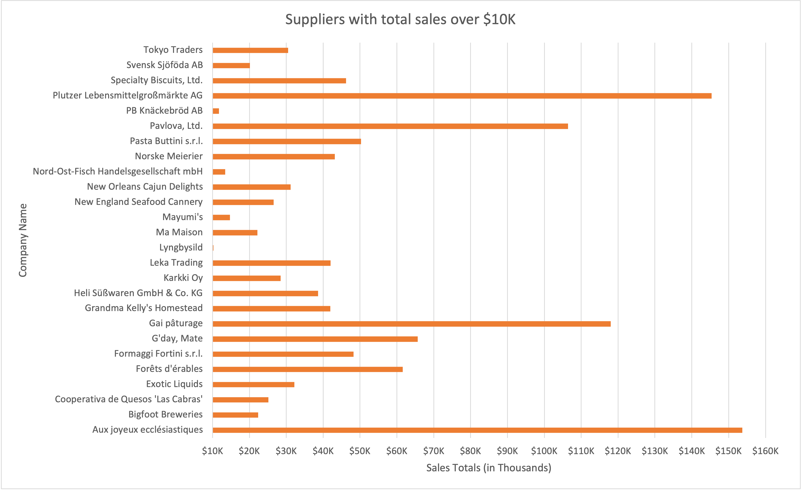

<p align="center">
  <a href="../img/northwind-er-diagram.png">
    
  </a>
</p>
<h1 align="center">:globe_with_meridians: SQL Mini Project :globe_with_meridians:</h1>

<br>

## Table of Contents

#### [Introduction :boom:](#intro)   
#### [Exercise 1 :tornado:](#ex1)   
#### [Exercise 2 :shield:](#ex2)   
#### [Exercise 3 :monocle_face:](#ex3)   
#### [Standards :closed_book:](#standards)   

<div id='intro'/>

<br>

## Introduction :boom:

_This exercise requires you to know the following aspects of SQL:_

|     :writing_hand:	        |     :brain:	                          |
|-----------------------------|---------------------------------------|
|     CREATE TABLE            |     Concatenation                     |
|     SQL Data   Types        |     Formatting   dates and numbers    |
|     INSERT INTO             |     Column aliases                    |
|     SELECT                  |     Simple JOIN   statements          |
|     WHERE clause            |     Complex JOIN statements           |
|     LIKE and   wildcards    |     Subquery                          |


<div id='ex1'/>

<br>

## Exercise 1 – Northwind Queries :tornado: _(40 marks: 5 for each question)_

1. _**Write a query that lists all Customers in either Paris or London. Include Customer ID, Company Name and all address fields.**_    

###### Query

I attempted to adopt this [SQL Style Guide](https://www.sqlstyle.guide/) for my indentation to make my queries as readable as possible. I try to implement column aliasing wherever I can to ensure accuracy and prevent errors, as well as Azure providing code completion when doing so. I concatenated all the address columns for simplicity.
      
```sql
    SELECT c.CustomerID AS "Customer ID", 
           c.CompanyName AS "Company Name",  
           CONCAT(c.Address, ', ',
                  c.City,
                  c.Region, ', ', 
                  c.PostalCode, ', ', 
                  c.Country) AS "Customer Address"
      FROM Customers AS c 
     WHERE c.City IN ('Paris', 'London');
```

###### Response

| Customer ID | Company Name          | Customer Address                                  |
|-------------|-----------------------|---------------------------------------------------|
| AROUT       | Around the Horn       | 120 Hanover Sq., London, WA1 1DP, UK              |
| BSBEV       | B's Beverages         | Fauntleroy Circus, London, EC2 5NT, UK            |
| CONSH       | Consolidated Holdings | Berkeley Gardens 12  Brewery, London, WX1 6LT, UK |
| EASTC       | Eastern Connection    | 35 King George, London, WX3 6FW, UK               |
| NORTS       | North/South           | South House 300 Queensbridge, London, SW7 1RZ, UK |
| PARIS       | Paris spécialités     | 265, boulevard Charonne, Paris, 75012, France     |
| SEVES       | Seven Seas Imports    | 90 Wadhurst Rd., London, OX15 4NB, UK             |
| SPECD       | Spécialités du monde  | 25, rue Lauriston, Paris, 75016, France           |

<br>

2. _**List all products stored in bottles.**_

###### Query

I opted to use a wildcard on the only column in the table where the term `bottles` was present.

```sql
    SELECT p.ProductName AS "Product Name"
      FROM Products AS p
     WHERE p.QuantityPerUnit LIKE '%bottles';
```

###### Response

| Product Name                     |
|----------------------------------|
| Chang                            |
| Aniseed Syrup                    |
| Genen Shouyu                     |
| Sasquatch Ale                    |
| Steeleye Stout                   |
| Côte de Blaye                    |
| Sirop d'érable                   |
| Louisiana Fiery Hot Pepper Sauce |
| Laughing Lumberjack Lager        |
| Outback Lager                    |
| Rhönbräu Klosterbier             |

<br>

3. _**Repeat question above, but add in the Supplier Name and Country.**_

###### Query

A simple `JOIN` sufficed for adding the two desired columns.

```sql
    SELECT p.ProductName AS "Product Name", 
           s.CompanyName AS "Supplier Name",
           s.Country
      FROM Products AS p
      JOIN Suppliers AS s 
        ON p.SupplierID = s.SupplierID
     WHERE p.QuantityPerUnit LIKE '%bottles';
```

###### Response

| Product Name                     | Supplier Name                     | Country   |
|----------------------------------|-----------------------------------|-----------|
| Chang                            | Exotic Liquids                    | UK        |
| Aniseed Syrup                    | Exotic Liquids                    | UK        |
| Genen Shouyu                     | Mayumi's                          | Japan     |
| Sasquatch Ale                    | Bigfoot Breweries                 | USA       |
| Steeleye Stout                   | Bigfoot Breweries                 | USA       |
| Côte de Blaye                    | Aux joyeux ecclésiastiques        | France    |
| Sirop d'érable                   | Forêts d'érables                  | Canada    |
| Louisiana Fiery Hot Pepper Sauce | New Orleans Cajun Delights        | USA       |
| Laughing Lumberjack Lager        | Bigfoot Breweries                 | USA       |
| Outback Lager                    | Pavlova, Ltd.                     | Australia |
| Rhönbräu Klosterbier             | Plutzer Lebensmittelgroßmärkte AG | Germany   |

<br>

4. _**Write an SQL Statement that shows how many products there are in each category. Include Category Name in result set and list the highest number first.**_

###### Query

Due to category names being unique, I could group by this column, otherwise I would have simply stuck to Category ID. `ORDER BY` allowed me to list the highest number first.

```sql
    SELECT c.CategoryName AS "Category Name",
           COUNT(p.ProductID) AS "No. of Items"
      FROM Categories AS c
      JOIN Products AS p 
        ON c.CategoryID = p.CategoryID
     GROUP BY c.CategoryName
     ORDER BY "No. of Items" DESC;
```

###### Response

| Category Name  | No. of Items |
|----------------|--------------|
| Confections    | 13           |
| Beverages      | 12           |
| Condiments     | 12           |
| Seafood        | 12           |
| Dairy Products | 10           |
| Grains/Cereals | 7            |
| Meat/Poultry   | 6            |
| Produce        | 5            |

<br>

5. _**List all UK employees using concatenation to join their title of courtesy, first name and last name together. Also include their city of residence.**_

###### Query

I opted to combine Employee Name related columns together, as well as aliasing the columns identical to the question wording.

```sql
    SELECT CONCAT(e.TitleOfCourtesy, ' ', 
                  e.FirstName, ' ', 
                  e.LastName) AS "Employee Name",
           e.City AS "City of Residence"
      FROM Employees AS e 
```

###### Response

| Employee Name         | City of Residence |
|-----------------------|-------------------|
| Ms. Nancy Davolio     | Seattle           |
| Dr. Andrew Fuller     | Tacoma            |
| Ms. Janet Leverling   | Kirkland          |
| Mrs. Margaret Peacock | Redmond           |
| Mr. Steven Buchanan   | London            |
| Mr. Michael Suyama    | London            |
| Mr. Robert King       | London            |
| Ms. Laura Callahan    | Seattle           |
| Ms. Anne Dodsworth    | London            |

<br>

6. _**List Sales Totals for all Sales Regions (via the Territories table using 4 joins) with a Sales Total greater than 1,000,000. Use rounding or FORMAT to present the numbers.**_ 

###### Query

Due to only being restricted to using 4 joins, I could not combine `territories` with `region` whilst also linking to `[Order Details]` (consult [ERD](../img/northwind-er-diagram.png) for context), and so could not include `region_description`, something I would have liked to. I chose to format the Sales Total as USD with 2 decimal places, the database being of american origin as far as I know. I initially attempted a `WHERE` clause, but due to needing to carry out arithmetic operations, switched to `HAVING`.

```sql
    SELECT DISTINCT t.RegionID AS "Sales Region ID", 
           FORMAT(SUM(od.UnitPrice * od.Quantity * (1 - od.Discount)), 'C2', 'en-us') AS "Sales Total"
      FROM Territories AS t
           JOIN EmployeeTerritories AS et 
             ON t.TerritoryID = et.TerritoryID
           JOIN Employees AS e 
             ON et.EmployeeID = e.EmployeeID
           JOIN Orders AS o 
             ON e.EmployeeID = o.EmployeeID
           JOIN [Order Details] AS od 
             ON o.OrderID = od.OrderID
     GROUP BY t.RegionID
    HAVING SUM(od.UnitPrice * od.Quantity * (1 - od.Discount)) > 1000000
     ORDER BY t.RegionID;
```

###### Response

| Sales Region ID | Sales Total   |
|-----------------|---------------|
| 1               | $2,730,198.01 |
| 2               | $1,615,248.00 |
| 3               | $1,048,605.58 |

<br>

7. _**Count how many Orders have a Freight amount greater than 100.00 and either USA or UK as Ship Country.**_

Pretty self explanatory and straightforward.

###### Query

```sql
    SELECT COUNT(*) AS "Freight > 100.00 and Ship to UK/USA" 
      FROM Orders ord
     WHERE ord.Freight > 100.00 
       AND ord.ShipCountry IN ('UK', 'USA');
```

###### Response

| Freight > 100.00 and Ship to UK/USA |
|-------------------------------------|
| 49                                  |

<br>

8. _**Write an SQL Statement to identify the Order Number of the Order with the highest amount(value) of discount applied to that order.**_

###### Query

I used `TOP 1`, since only a single highest value has ben asked for, using `ORDER BY` to ensure this value is the highest. Again, I have formatted the value to USD.

```sql
    SELECT TOP 1 od.OrderID AS "Order Number",
           FORMAT((od.Discount * od.Quantity * od.Discount), 'C2', 'en-us') AS "Value of Discount"
      FROM [Order Details] od
     ORDER BY "Value of Discount" DESC;
```

###### Response

| Order Number | Value of Discount |
|--------------|-------------------|
| 10595        | $7.50             |

<div id='ex2'/>

<br>

## Exercise 2 – Create Spartans Table :shield: _(20 marks – 10 each)_

1. _**Write the correct SQL statement to create the following table:**_
    - **Spartans Table** – _include details about all the Spartans on this course. Separate Title, First Name and Last Name into separate columns, and include University attended, course taken and mark achieved. Add any other columns you feel would be appropriate._
    - **IMPORTANT NOTE:** _For data protection reasons do NOT include date of birth in this exercise._

###### Query

I decided that all values should not be null, since Sparta Global would require all this information about each of their consultants. To ensure the table was successfully created, I ran the `SELECT` as well. It is worth noting that I also included `DROP TABLE spartans_table` in the [query file](../project/SQLQuery_sqlminiproject.sql) for use when necessary.

```sql
    CREATE TABLE spartans_table
    (
        spartan_id INT IDENTITY(1,1) PRIMARY KEY,
        title VARCHAR(6) NOT NULL DEFAULT 'Mx.',
        first_name VARCHAR (20) NOT NULL,
        last_name VARCHAR (20) NOT NULL,
        uni_attended VARCHAR(50) NOT NULL,
        course_taken VARCHAR(50) NOT NULL,
        mark_achieved VARCHAR(3) NOT NULL
    );

    SELECT TABLE_NAME FROM INFORMATION_SCHEMA.TABLES;
```

###### Response

| TABLE_NAME     |
|----------------|
| spartans_table |

<br>

2. _**Write SQL statements to add the details of the Spartans in your course to the table you have created.**_

I chose to state the columns I was inputting, so as to ensure no errors occured from attempting to input into `spartan_id`, since it is auto-incrementing.

###### Query

```sql
    INSERT INTO spartans_table
    (title, first_name, last_name, uni_attended, course_taken, mark_achieved)
    VALUES
    ('Mr', 'John', 'Smith', 'University College London', 'Aeronautical Engeineering', '1st'),
    ('Mrs', 'Alex', 'Rogan', 'Aberystwyth University', 'Law', '2:1'),
    ('Ms', 'Joe', 'Jones', 'London School of Economics', 'Physics', '1st'),
    ('Mr', 'Idris', 'Weinstein', 'University of Sunderland', 'English Literature', '3rd'),
    ('Miss', 'Harvey', 'Elba', 'University of Manchester', 'Mathematics', '2:2'),
    ('Mr.', 'Alexander', 'Stalin', 'University of Birmingham', 'Computer Science', '2:1'),
    ('Mx', 'Smirnoff', 'McGinn', 'Birmingham City University', 'Sport Science', '1st'),
    ('Dr', 'Connor', 'Ice', 'University of Edinburgh', 'Dentistry', '1st'),
    ('Miss', 'Steve', 'Austin', 'University of Southampton', 'Forensics Computing', '1st'),
    ('Mr.', 'Steve', 'Austin', 'King’s College London', 'English Language and Linguistics', '2:2');
```

###### Response

| spartan_id | title | first_name | last_name | uni_attended               | course_taken                     | mark_achieved |
|------------|-------|------------|-----------|----------------------------|----------------------------------|---------------|
| 1          | Mr    | John       | Smith     | University College London  | Aeronautical Engeineering        | 1st           |
| 2          | Mrs   | Alex       | Rogan     | Aberystwyth University     | Law                              | 2:1           |
| 3          | Ms    | Joe        | Jones     | London School of Economics | Physics                          | 1st           |
| 4          | Mr    | Idris      | Weinstein | University of Sunderland   | English Literature               | 3rd           |
| 5          | Miss  | Harvey     | Elba      | University of Manchester   | Mathematics                      | 2:2           |
| 6          | Mr.   | Alexander  | Stalin    | University of Birmingham   | Computer Science                 | 2:1           |
| 7          | Mx    | Smirnoff   | McGinn    | Birmingham City University | Sport Science                    | 1st           |
| 8          | Dr    | Connor     | Ice       | University of Edinburgh    | Dentistry                        | 1st           |
| 9          | Miss  | Steve      | Austin    | University of Southampton  | Forensics Computing              | 1st           |
| 10         | Mr.   | Steve      | Austin    | King\'s College London    | English Language and Linguistics | 2:2           |

<div id='ex3'/>

<br>

## Exercise 3 – Northwind Data Analysis linked to Excel :monocle_face: _(30 marks)_

1. **_List all Employees from the Employees table and who they report to. No Excel required. Include Employee names and ReportTo names._ (5 Marks)**

###### Query

Prior to attempting this query, I was not aware one could join a table to itself, something that I was pleasantly surprised by.

```sql
    SELECT CONCAT(e.FirstName, ' ', e.LastName) AS "Employee Name",
           CONCAT(b.FirstName, ' ', b.LastName) AS "Reports To"
      FROM Employees AS e
           JOIN Employees AS b 
             ON e.ReportsTo = b.EmployeeID;
```

###### Response

| Employee Name    | Reports To      |
|------------------|-----------------|
| Nancy Davolio    | Andrew Fuller   |
| Janet Leverling  | Andrew Fuller   |
| Margaret Peacock | Andrew Fuller   |
| Steven Buchanan  | Andrew Fuller   |
| Michael Suyama   | Steven Buchanan |
| Robert King      | Steven Buchanan |
| Laura Callahan   | Andrew Fuller   |
| Anne Dodsworth   | Steven Buchanan |

<br>

2. **_List all Suppliers with total sales over $10,000 in the Order Details table. Include the Company Name from the Suppliers Table and present as a bar chart_ (5 Marks)**

###### Query

I initially tried formatting Sales Total as USD, but encountered some issues when creating the bar chart, therefore sitcking to just `CONVERT`, in order to limit decimal places. I order by Company Name with Excel in mind, this being my preferred way of displayng the bar chart.

```sql
    SELECT s.CompanyName AS "Company Name",
           CONVERT(real, SUM(od.UnitPrice * od.Quantity * (1 - od.Discount)), 0) AS "Sales Total"
      FROM Suppliers AS s
           JOIN Products AS p 
             ON s.SupplierID = p.SupplierID
           JOIN [Order Details] AS od 
             ON p.ProductID = od.ProductID
     GROUP BY s.CompanyName
    HAVING SUM(od.UnitPrice * od.Quantity * (1 - od.Discount)) > 10000
    ORDER BY "Company Name";
```

###### Response

| Company Name                           | Sales Total |
|----------------------------------------|-------------|
| Aux joyeux ecclésiastiques             | 153691.28   |
| Bigfoot Breweries                      | 22391.2     |
| Cooperativa de Quesos 'Las Cabras'     | 25159.43    |
| Exotic Liquids                         | 32188.06    |
| Forêts d'érables                       | 61587.57    |
| Formaggi Fortini s.r.l.                | 48225.164   |
| Gai pâturage                           | 117981.18   |
| G'day, Mate                            | 65626.77    |
| Grandma Kelly's Homestead              | 41953.3     |
| Heli Süßwaren GmbH & Co. KG            | 38653.418   |
| Karkki Oy                              | 28442.729   |
| Leka Trading                           | 42017.645   |
| Lyngbysild                             | 10221.175   |
| Ma Maison                              | 22154.637   |
| Mayumi's                               | 14736.755   |
| New England Seafood Cannery            | 26590.975   |
| New Orleans Cajun Delights             | 31167.99    |
| Nord-Ost-Fisch Handelsgesellschaft mbH | 13424.197   |
| Norske Meierier                        | 43141.51    |
| Pasta Buttini s.r.l.                   | 50254.61    |
| Pavlova, Ltd.                          | 106459.77   |
| PB Knäckebröd AB                       | 11724.06    |
| Plutzer Lebensmittelgroßmärkte AG      | 145372.4    |
| Specialty Biscuits, Ltd.               | 46243.98    |
| Svensk Sjöföda AB                      | 20144.06    |
| Tokyo Traders                          | 30526.34    |

###### Bar Chart

I chose to order by company name rather than Sales Total, thus giving a less uniform look to the data, instead providing variance. There is, however, [the bar chart ordered by Sales Total](../img//barchart_ordered_by_sales_total.png) for those that prefer it. 

<p align="center">
  <a href="../img/barchart_ordered_by_company_name.png">
    
  </a>
</p>

<br>

3. **_List the Top 10 Customers YTD for the latest year in the Orders file. Based on total value of orders shipped. No Excel required._ (10 Marks)**

###### Query

I intially hard coded the latest year, but after gaining some feedback from my trainer, reluctantly implemented a subquery to find it. I must admit it is a much safer and future proof approach.

```sql
    SELECT TOP 10 c.CompanyName,
           CONVERT(real, SUM(od.UnitPrice * od.Quantity * (1 - od.Discount)), 0) AS "Orders Total"
      FROM Customers AS c
           JOIN Orders AS o 
             ON c.CustomerID = o.CustomerID
           JOIN [Order Details] AS od 
             ON o.OrderID = od.OrderID
     WHERE YEAR(o.OrderDate) = (
           SELECT TOP 1 YEAR(o.ShippedDate)
             FROM Orders AS o 
            ORDER BY o.ShippedDate DESC)
       AND o.ShippedDate IS NOT NULL
     GROUP BY c.CompanyName
     ORDER BY "Orders Total" DESC;
```

###### Response

| CompanyName                  | Orders Total |
|------------------------------|--------------|
| QUICK-Stop                   | 37217.316    |
| Save-a-lot Markets           | 36310.11     |
| Ernst Handel                 | 31311.75     |
| Hanari Carnes                | 23821.2      |
| Hungry Owl All-Night Grocers | 20402.12     |
| Rattlesnake Canyon Grocery   | 19982.55     |
| Königlich Essen              | 19582.773    |
| White Clover Markets         | 15278.9      |
| Folk och fä HB               | 13644.067    |
| Suprêmes délices             | 11644.6      |

<br>

4. **_Plot the Average Ship Time by month for all data in the Orders Table using a line chart._ (10 Marks)**

###### Query

I extracted the first 7 characters from Order Date, converting it into a date format that I could order by month and year using one column. I used `DATEDIFF` to get the ship time and `AVG` to aggregate it, grouping it by the new `Date` column I had created and aliased, being able to `ORDER BY` said alias due to SQL processing `SELECT` before `ORDER BY`. `GROUP BY`, however, does not, and `Average Ship Time (Days)` could not be used there (I added `(Days)` with the line chart in mind).

```sql
    SELECT DISTINCT LEFT(CONVERT(char, o.OrderDate, 20), 7) AS "Date",
           AVG(DATEDIFF(day, o.OrderDate, o.ShippedDate))  AS "Average Ship Time (Days)"
      FROM Orders o
     GROUP BY LEFT(CONVERT(char, o.OrderDate, 20), 7)
     ORDER BY "Date";
```

###### Response

| Date    | Average Ship Time (Days) |
|---------|--------------------------|
| 1996-07 | 8                        |
| 1996-08 | 8                        |
| 1996-09 | 10                       |
| 1996-10 | 6                        |
| 1996-11 | 8                        |
| 1996-12 | 7                        |
| 1997-01 | 9                        |
| 1997-02 | 9                        |
| 1997-03 | 8                        |
| 1997-04 | 9                        |
| 1997-05 | 9                        |
| 1997-06 | 8                        |
| 1997-07 | 8                        |
| 1997-08 | 6                        |
| 1997-09 | 9                        |
| 1997-10 | 8                        |
| 1997-11 | 8                        |
| 1997-12 | 9                        |
| 1998-01 | 9                        |
| 1998-02 | 7                        |
| 1998-03 | 9                        |
| 1998-04 | 6                        |
| 1998-05 | 2                        |

###### Line Chart

Little explanation is rquired. I encountered some minor difficulty when formatting the date, due to Excel classing `Date` as text, nothing a quick ~~google~~ DuckDuckGo couldn't fix.

<p align="center">
  <a href="../img/linechart.png">
    
  </a>
</p>

<div id='standards'/>

<br>

## Standards :closed_book: _(10 marks)_

_Remember to apply all the following standards:_
- [x] _Use consistent capitalisation and indentation of SQL Statements_
- [x] _Use concise and consistent table alias names_
- [x] _Use column aliases to ensure tidy column headings (spaces and consistent capitalisation)_
- [x] _Concatenate any closely related columns e.g. First Name and Last Name or Address and City etc_
- [x] _Put comments throughout_

I believe I have completed everything as desired.
